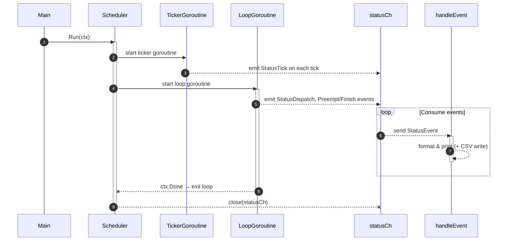
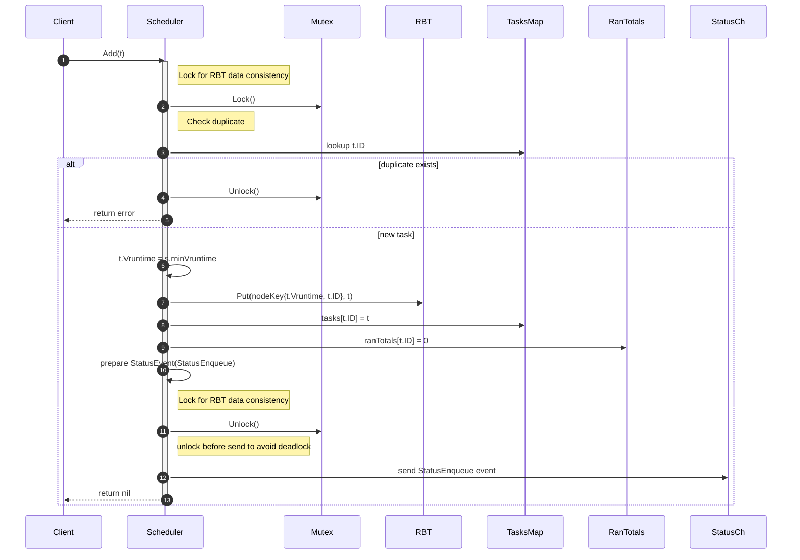
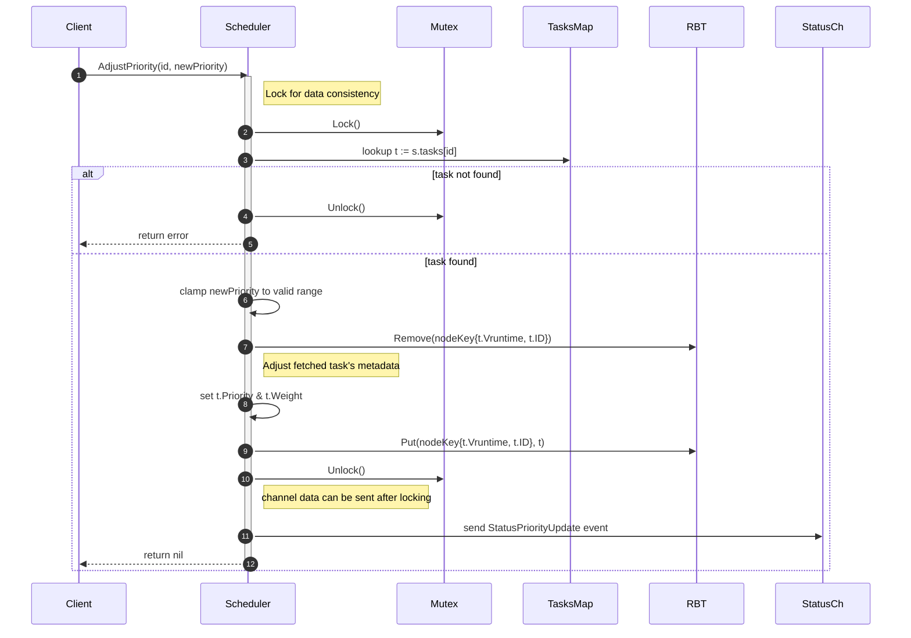
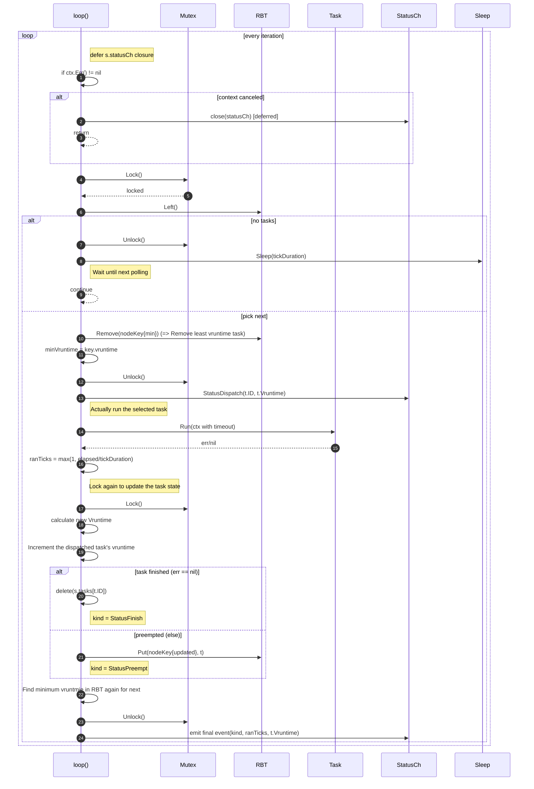
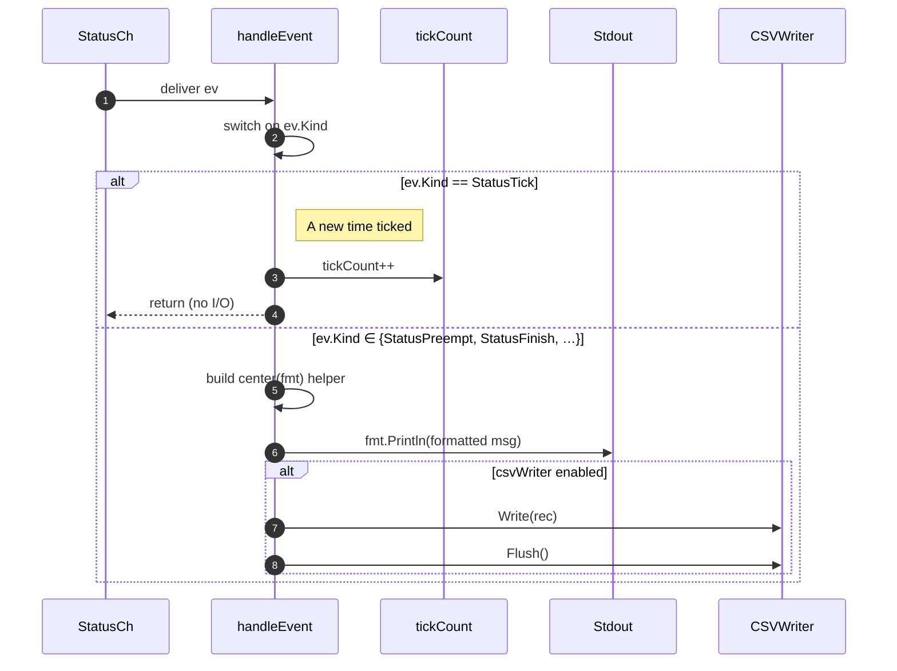

# vrunq

### Note
The following Mermaid sequence charts at `Mechanisms` may be updated to reflect the latest commit.

### Mechanisms

1. `Run(ctx context.Context)`
- Spawns ticker goroutine (emits `StatusTick`).
- Spawns a loop in its goroutine.
- Drains `statusCh`, calls `handleEvent`, then cleans up CSV and returns.

2. `Add (t *Task)`
- Locks, checks duplicates, seeds `Vruntime` to `minVruntime`, inserts into the red-black tree and maps, unlocks, emits `StatusEnqueue` event data.

3. `AdjustPriority(id TaskID, newPriority int)`
- Adjust the priority(weight => vruntime factor) of the specific task in the red-black tree runqueue.
- The task must be present in the red-black tree, so task in execution will not be able to adjust its task scheduling priority.

4. `loop(ctx context.Context)`

5. `handleEvent(ev StatusEvent)`

